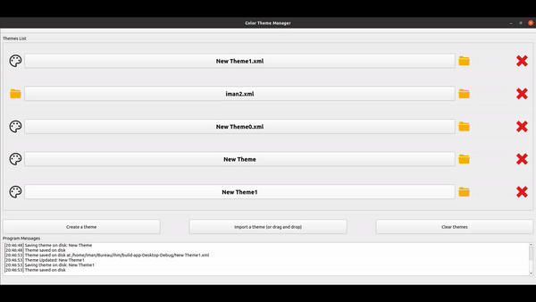

# Color Theme Manager
### Iman IRAJ DOOST - 22102163

## Using the app

## Implemeted features

- All features are implemented utill the final level (except the bonus part)
- The windows are responsive
- Ability to save and load last session of the user by using a 'xmlSettings.xml' file
- Save and load themes in files (XML)
- Show theme files in explorer
- Show and save theme icons
- Create a theme (creates a file and adds a number to the file if a file with the same name already exists)
- Import a theme file (XML) using explorer or by dragging and dropping the file on the window
- Program prints errors or important messages for user
- Ability to edit a theme's icon and name (if the name of the file already exists an error will be shown to the user)
- Ability to add, edit and delete colors for a theme. (This is a section which I'm proud of :D) By editing a theme in any way (its parameters or its colors), we have an 'undo' button to revert the change we made, and we have to press on the save button to save the modifications in the main file. If we want to close the window without saving, a dialog will be shown to user for confirmation.
- Ability to choose colors using a color picker
- Show the color and its code in the UI
- Resize the icon to match the icon placeholder
- Import themes from Internet: Ability to check if the URL is valid, and then, it will give user two options; either choose to overwrite the colors with the same color ID, or create new colors with duplicated IDs
- Apply the colors in the theme on a file (text, xml or anything textual) by choosing the file or dragging and dropping the file

## Bugs and improvement points
- If we create A LOT of theme files (more than 1000) the counter in 'create theme' button will not work
- If the user tempers with the XML files directly, or changes the file locations, the app might crash
- It's possible to open multiple themes together (it might cause problems, I'm not sure but I need to do more testing)
- UI can be improved (ex. more icons instead of buttons)
- A delete button for each theme is a good idea !
- We can add an option for applying colors to themes; if the user wants to change a file, they can save it under the same name (overwrite it) or as a new file. (So they won't tamper the original file)